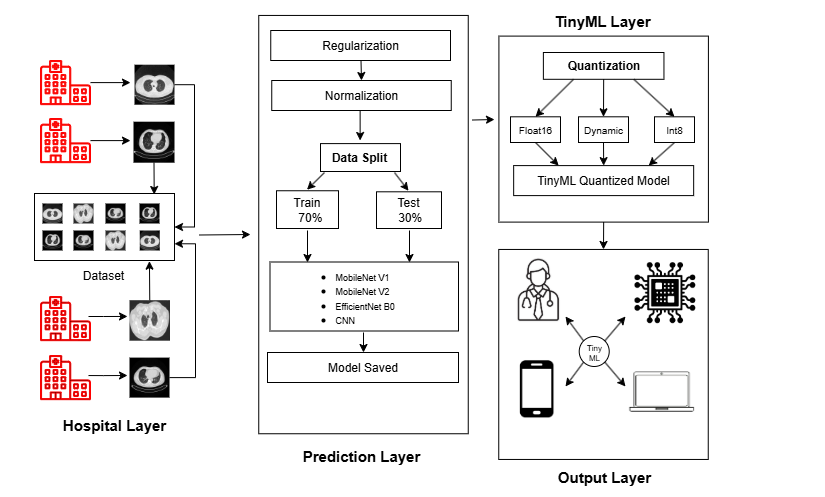

# TinyML-Assisted Energy and Space Efficient Framework for Lung Cancer Detection

A TinyML-assisted deep learning framework for binary lung cancer classification using CT scan images, lightweight neural networks, optimizer comparison, and post-training quantization for resource-constrained edge deployment.

## Overview

Lung cancer detection from CT scan images is an important medical imaging application where artificial intelligence can assist in identifying patterns associated with disease.

This project investigates an energy- and space-efficient approach for classifying lung CT scan images into **Benign** and **Malignant** categories. Multiple lightweight deep learning models and optimizers are evaluated to identify a suitable model for the application.

The best-performing model is then converted into a lightweight **TensorFlow Lite (TFLite)** model using post-training quantization, enabling potential deployment on resource-constrained edge and TinyML platforms.

> **Disclaimer:** This project is a research and educational prototype. It is not intended to replace professional medical diagnosis or clinical decision-making.

## Proposed Framework

The proposed framework consists of four major layers:

1. **Hospital Layer** – Collection of medical imaging data.
2. **Prediction Layer** – Image preprocessing, augmentation, and deep learning-based classification.
3. **TinyML Layer** – Model compression using post-training quantization.
4. **Output Layer** – Lightweight inference on resource-constrained or edge devices.



## Dataset

## Dataset

This project uses the **IQ-OTH/NCCD Lung Cancer Dataset**, obtained from Kaggle.

The dataset contains CT scan images categorized into three classes:
- **Benign**
- **Malignant**
- **Normal**

For this project, only the **Benign** and **Malignant** classes are used for binary lung cancer classification. The **Normal** class is excluded.

The dataset is not included in this repository. You can access it here:

**Dataset:** [IQ-OTH/NCCD - Lung Cancer Dataset](https://www.kaggle.com/datasets/adityamahimkar/iqothnccd-lung-cancer-dataset)

During model training, images are resized, normalized using the MobileNetV2 preprocessing function, and training-time data augmentation is applied.

The labels used in the project are:

- `0` → Benign
- `1` → Malignant

The images are stored in `.jpg` format.

The dataset was divided into:

- **70% Training**
- **30% Validation**

The images were resized and normalized before being provided to the deep learning models. Data augmentation was also applied during training to introduce additional variations and improve model robustness.

The complete medical imaging dataset is **not included in this repository** because it is a third-party dataset. Users should obtain the dataset from its original source and follow its applicable license and terms of use.

## Models and Optimization

### Deep Learning Models

Four deep learning models were evaluated for binary classification of **Benign** and **Malignant** lung CT images:

- **MobileNet-V1**
- **MobileNet-V2**
- **EfficientNetB0**
- **CNN with MobileNet-V3 Transfer Learning**

These models were compared based on classification performance, including accuracy, precision, recall, ROC-AUC, confusion matrix, and model size. The objective was to identify a model that provides good classification performance while remaining suitable for resource-constrained TinyML deployment.

### Optimizers

Three optimizers were compared during model training:

- **Adam**
- **RMSprop**
- **Nadam**

The optimizer performance was evaluated across the different deep learning architectures. **RMSprop with MobileNet-V2** achieved the best reported performance in the study, with an accuracy of **97.78% before quantization** and **97.92% after quantization**.

### Evaluation Metrics

The models were evaluated using the following metrics:

- **Accuracy**
- **Precision**
- **Recall**
- **Confusion Matrix**
- **ROC Curve and AUC**
- **Model Size**

These metrics were used to evaluate both classification performance and the efficiency of the models for TinyML deployment.

### Post-Training Quantization

After training, the models were converted to **TensorFlow Lite (TFLite)** using **Post-Training Quantization (PTQ)** to reduce their memory footprint and improve their suitability for edge deployment.

Three quantization techniques were investigated:

1. **Dynamic Range Quantization**
2. **Float16 Quantization**
3. **INT8 Quantization**

The quantized models were evaluated to determine the trade-off between model size and classification accuracy.

### Best-Performing Model

**MobileNet-V2 with RMSprop** achieved the best overall performance in the study.

| Metric | Result |
|---|---:|
| Pre-quantization Accuracy | **97.78%** |
| Post-quantization Accuracy | **97.92%** |
| Original Model Size | **18.89 MB** |
| Quantized Model Size | **2.39 MB** |
| Model Size Reduction | **87.35%** |
| ROC-AUC | **0.997** |

The results demonstrate that MobileNet-V2 can provide a strong balance between classification performance and model size, making it suitable for TinyML and resource-constrained edge deployment.

## Methodology

The overall workflow of the project is:

```text
CT Scan Dataset
       ↓
Benign & Malignant Selection
       ↓
Image Preprocessing
       ↓
Resizing + Normalization
       ↓
Data Augmentation
       ↓
70% Training / 30% Validation
       ↓
Model Training
       ↓
Optimizer Comparison
       ↓
Performance Evaluation
       ↓
Best Model Selection
       ↓
Post-Training Quantization
       ↓
TFLite Model
       ↓
Lightweight Edge Inference
       ↓
Benign / Malignant Prediction
